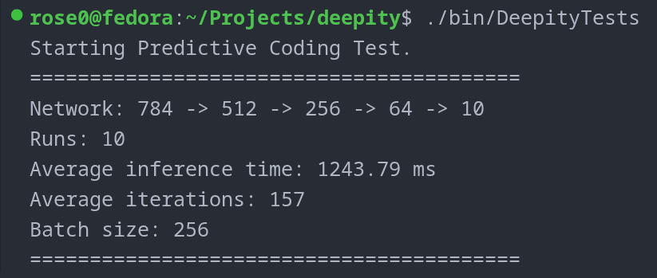
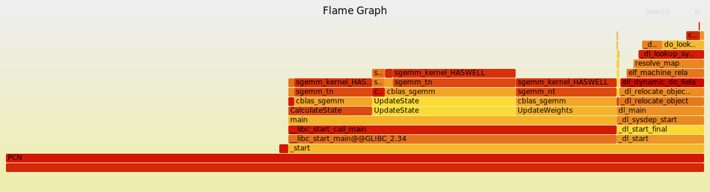
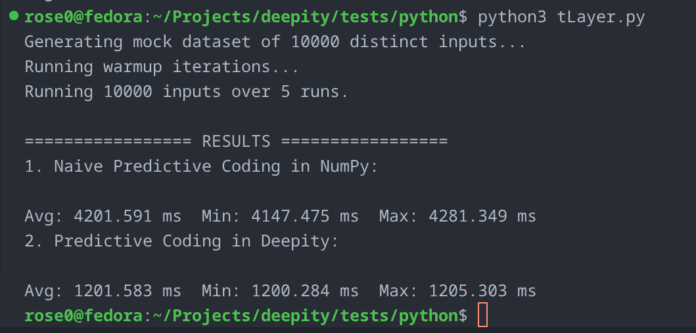
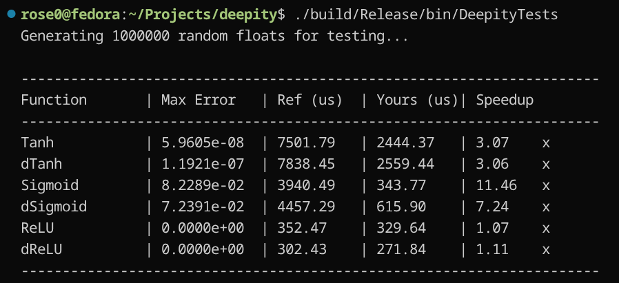

# 

Deepity is a Predictive Coding (PC) model library designed for ultra-low variance, high-speed inference and updating. The library is heavily CPU-optimized, with CUDA support on the horizon.

<p align="center">

</p>

---

<p align="center">
  
</p>

## 🚀 Performance at a Glance

When running on a **Dell Inspiron 16 Plus 7620** equipped with a **12th Gen Intel® Core™ i7-12700H (20 logical processors)**, Deepity sustains approximately **116 GFLOPS** during predictive-coding inference and learning.

For the benchmark configuration:

- **Network:** 784 → 512 → 256 → 64 → 10
- **Batch size:** 256
- **Iterations:** 157
- **Average runtime:** 1.244 s

The dominant computation consists of batched single-precision matrix multiplications (`SGEMM`), corresponding to approximately **144.4 GFLOPs** of floating-point work:

$$
\frac{144.4\text{ GFLOPs}}{1.24379\text{ s}}
\approx
116.1\text{ GFLOPS}
$$

The Python bindings maintain this performance with negligible overhead, benchmarking **approximately 3.5× faster** than an equivalent NumPy implementation.

<p align="center">

</p>

| Implementation | Avg (ms) | Min (ms) | Max (ms) |
| --- | ---: | ---: | ---: |
| **Deepity (Python)** | **1201.6** | **1200.3** | **1205.3** |
| NumPy (naive) | 4201.6 | 4147.5 | 4281.3 |

*In our experiments, Deepity substantially outperformed an equivalent NumPy implementation, while high-level research frameworks typically incur additional overhead from Python execution and tensor abstractions.*

---

## 🛠️ Example Usage

### C++

Getting a predictive coding layer up and running in Deepity is straightforward:

```cpp
#include "PCLayer.h"
#include "Activations.h"
#include <vector>

int main(void)
{
    Deep::PCLayer pc(1000, 100);

    std::vector<float> input_sample(1000, 0.5f);
    
    pc.ClampState(input_sample);

    for (int i = 0; i < 157; ++i)
    {
        pc.CalculateState();
        pc.UpdateState();
    }

    pc.UpdateWeights();
    pc.UnclampState();

    #ifdef _DEBUG
    pc.DebugStats();
    #endif

    return 0;
}
```

### Python

Deepity ships with Python bindings via pybind11:

```python
import deepity as deep
import numpy as np

net = deep.PCNetwork()

# Build network
net.add_layer(784, 256, lr=1e-4, act="relu", dact="drelu")
net.add_layer(256, 64,  lr=1e-4, act="relu", dact="drelu")
net.add_layer(64, 10,   lr=1e-4, act="relu", dact="drelu")

net.randomize_weights()

# Input
x = np.random.uniform(0.0, 1.0, 784).astype(np.float32)

# Clamp input
net.clamp(x)

# Inference loop
for _ in range(50):
    energy = net.calculate_state()
    net.update_state()

# Learning step (if desired)
net.update_weights()

print("Final energy:", energy)
```

---

## ⚡ Core Architecture Features

**Custom SIMD Activation Functions**
Deepity bypasses standard C++ library bottlenecks by implementing highly optimized activation functions using AVX2 and AVX-512 intrinsics.

**High-Performance Tanh**
Bypasses expensive `expf` evaluations using a highly tuned Padé rational polynomial approximation, yielding up to a ~40% speedup over `std::tanh`.

<p align="center">

</p>

**Vectorized ReLU**
Processes up to 16 floats per clock cycle, completely saturating standard single-core RAM bandwidth limits (~15.8 GB/s).

**Strict 64-byte Alignment**
To prevent hardware exceptions and segmentation faults when loading wide 256-bit or 512-bit registers, Deepity enforces strict 64-byte memory boundaries (via `std::align_val_t{64}`) for all internal sequential sub-buffers ($W$, $z$, $p$, $err$).

**Contiguous Arena Allocator**
All layer buffers in a network are packed into a single contiguous memory block, maximising cache locality and eliminating pointer-chasing overhead across layers.

---

## 📊 Single-Layer Benchmarks & Design Decisions

### 1. The Impact of Batch Size

Batching provides massive performance scaling. A batch size of **256** proved to be the sweet spot for maximum CPU throughput.

| Batch Size | Time (ms) |
| --- | --- |
| 1 (None) | 4484 |
| 16 | 3149 |
| 32 | 2634 |
| 64 | 2338 |
| 128 | 2263 |
| **256** | **2233** |
| 512 | 2265 |

### 2. Random Number Generation

We compared `OpenRAND` against the standard C++ `std::mt19937` generator. Results were within a 5% margin of error, so MT was chosen for its std-friendly design.

| Generator | Time (ms) |
| --- | --- |
| OpenRAND | 4712 |
| mt19937 | 4482 |

### 3. Memory Layout: Contiguous vs. Separate

Packing all layer attributes into a single flat array showed zero performance penalty over separate heap allocations, while providing simpler alignment guarantees and better cache behaviour.

| Layout | Time (ms) |
| --- | --- |
| Separate vectors | 4481 |
| Contiguous block | 4484 |

---

## 📅 Roadmap

- [x] SIMD micro-kernels — AVX2/AVX-512 Padé approximations for activations
- [x] Contiguous flat-memory buffers — cache-friendly, pointer-chasing-free
- [x] PCNetwork abstraction — layer hierarchy with bidirectional inference and generation
- [x] Python bindings — full pybind11 port with NumPy array support
- [ ] CUDA accelerated engine — moving GEMM operations to GPU for massive model scales
- [ ] Java port
- [ ] API reference documentation — Doxygen HTML guides

---

## 🏗️ Project Structure

```
includes/       # Public headers (PCLayer.h, PCNetwork.h, Activations.h, Optimize.h)
src/            # C++ source (PCLayer.cpp, PCNetwork.cpp)
pybind/         # Python bindings (binding.cpp)
tests/          # C++ and Python test suites
bin/            # Build outputs (library, executables, Python .so)
resources/      # Images and benchmark assets
```

---

Ra4ster (Jack R) @ 2026 ❤️