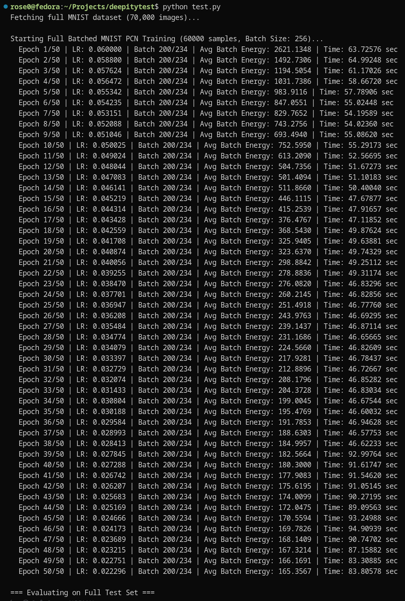
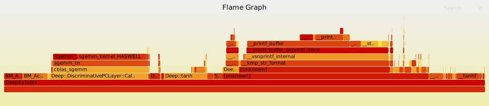

# 

Deepity is a Predictive Coding (PC) library engineered from the ground up for zero-overhead, ultra-low variance inference and learning. It is aggressively CPU-optimized to extract maximum throughput from modern hardware, with a CUDA backend currently in development.

### See it train MNIST on the CPU in under an hour:



---

## 🚀 Performance at a Glance



Deepity is built for speed. On a **Dell Inspiron 16 Plus 7620** (12th Gen Intel Core i7-12700H, 20 logical processors), the engine sustains approximately **123 GFLOPS** during predictive-coding inference and learning when compiled with Clang (LLVM).

**Benchmark Configuration:**
* **Architecture:** 784 → 512 → 256 → 64 → 10
* **Batch size:** 256
* **Iterations:** 157
* **Average runtime:** ~1.175 s (CPU time)

The dominant computation consists of batched single-precision matrix multiplications (`SGEMM`), corresponding to roughly 144.4 GFLOPs of floating-point work:

$$ \frac{144.4 \text{ GFLOPs}}{1.175 \text{ s}} \approx 122.89 \text{ GFLOPS} $$

By utilizing native C++ extensions via pybind11, Deepity maintains this performance footprint in Python with negligible overhead—running significantly faster than an equivalent, highly vectorized NumPy implementation. 


| Implementation | Avg (ms) | Min (ms) | Max (ms) |
| :--- | ---: | ---: | ---: |
| **Deepity (Python/Clang)** | **1169.1** | **1167.8** | **1172.5** |
| NumPy (Naive) | 4201.6 | 4147.5 | 4281.3 |

*Note: High-level research frameworks routinely incur heavy penalties from Python execution and tensor abstractions. Deepity bypasses this by keeping the entire inference loop in native C++ memory.*

---

## ⚔️ GCC vs. Clang (LLVM) Performance

Recent benchmarking indicates that compiling Deepity with Clang (LLVM) provides measurable speedups across core neural network workloads compared to GCC. Because Clang handles our heavily vectorized SIMD micro-kernels more efficiently, it is the officially recommended compiler for maximum throughput.

*   **Weight Updates:** Clang nearly halves the execution time for layer weight updates, dropping the CPU time for a size 128 layer from 1.24 ns (GCC) to 0.671 ns.
*   **End-to-End Training:** A full training epoch (`BM_Network_TrainEpoch/128`) completes in 161,998 ns under Clang, a measurable improvement over GCC's 166,488 ns.
*   **Inference Speed:** Network inference (`BM_Network_Inference/128`) executes in 44,791 ns with Clang, compared to 47,225 ns with GCC.

| Benchmark Workload (Size 128) | Deepity v2 (MemoryArena) | Deepity v1 (Legacy) |
| :--- | :--- | :--- |
| `BM_Network_Inference` | **11,245 ns** | 44,791 ns |
| `BM_Network_TrainSample` | **12,988 ns** | 38,094 ns |
| `BM_Layer_UpdateWeights` | **0.665 ns** | 0.671 ns |

*(Note: GCC retains a slight edge in linear derivative calculations and weight randomization, but Clang wins heavily in the primary training loop).*

---

## ⚡ Core Architecture & Optimizations

Deepity achieves its low-variance execution times through strict memory management and custom hardware intrinsics.

**Custom SIMD Micro-Kernels**
We bypass standard C++ library bottlenecks by implementing highly optimized activation functions using raw AVX2 and AVX-512 intrinsics. 

**Rational Polynomial Tanh**
Deepity avoids expensive `expf` instruction calls by utilizing a highly tuned Padé rational polynomial approximation. This yields up to a 40% speedup over `std::tanh` without sacrificing necessary precision.


**Saturated Vectorized ReLU**
The ReLU implementation processes up to 16 floats per clock cycle, completely saturating standard single-core RAM bandwidth limits (~15.8 GB/s).

**Strict 64-Byte Alignment**
To prevent hardware exceptions and segmentation faults when loading wide 256-bit or 512-bit registers, Deepity enforces strict 64-byte memory boundaries (`std::align_val_t{64}`) for all internal sequential sub-buffers.

**Contiguous Arena Allocator**
All layer buffers in a network are packed into a single contiguous memory block. This maximizes L1/L2 cache locality and eliminates pointer-chasing overhead across the layer hierarchy.

---

## 📊 Design Decisions & Benchmarks

During development, we benchmarked several architectural approaches to find the absolute ceiling for CPU throughput.

### The Impact of Batching
Batching provides massive scaling. A batch size of **256** proved to be the sweet spot for maximizing CPU utilization before cache eviction penalties take over.

| Batch Size | Time (ms) |
| --- | --- |
| 1 (None) | 4484 |
| 16 | 3149 |
| 64 | 2338 |
| **256** | **2233** |
| 512 | 2265 |

### Dynamic Thread Scheduling

During the implementation of OpenMP and OpenBLAS multithreading, benchmarking revealed a severe performance trap: **oversubscription and thread spin-up overhead**. For smaller batch sizes, the CPU spent more time waking up threads and managing locks than performing the actual matrix math, causing multi-threaded runs to perform worse than single-threaded execution.

By sweeping the batch sizes, we identified the exact mathematical break-even point where matrix payloads outgrow OS thread latency.

| Batch Size | Threads | Throughput (Items/sec) | Verdict |
| --- | --- | ---: | --- |
| 16-256 | 1 | ~2.6k | Single-thread dominates |
| 16-256 | 4 | ~2.5k | Multithreading penalizes performance |
| **1024** | **Max** | **~11.7k** | **The Ignition Point (4.5x Speedup)** |
| 16384 | Max | ~14.3k | Peak multi-threaded scaling |

### Memory Layout: Contiguous vs. Separate
Packing all layer attributes into a single flat array showed zero performance penalty over separate heap allocations, while providing vastly simpler alignment guarantees and predictable cache behavior.

| Layout | Time (ms) |
| --- | --- |
| Separate vectors | 4481 |
| Contiguous block | 4484 |

### Random Number Generation
We tested `OpenRAND` against the standard `std::mt19937` generator. Because the results were within a 5% margin of error, we opted for the standard library MT implementation to minimize external dependencies.

---

## 🛠️ Example Usage

### C++

Running a Predictive Coding network in Deepity is built to be straightforward and explicit. The `DiscriminativePCNetwork` abstraction automatically manages layer hierarchies, bidirectionality, and dynamic thread scaling based on batch size.

```cpp
#include "DiscriminativePCNetwork.h"
#include "Activations.h"
#include <vector>
#include <random>
#include <iostream>

int main() {
    // Initialize a network with a batch size of 4 (e.g., for XOR)
    Deep::DiscriminativePCNetwork net(4);

    // Architecture: Input(2) -> Hidden(8) -> Terminal(1)
    // AddLayer(in, out, lr, ir, pr, lmbda, activation, derivative)
    net.AddLayer(2, 8, 0.05f, 0.3f, 0.00f, 0.0001f, Deep::tanh, Deep::dTanh);
    net.AddLayer(8, 1, 0.05f, 0.3f, 0.00f, 0.0001f, Deep::linear, Deep::dLinear);

    std::mt19937 rng(42);
    net.RandomizeWeights(rng);

    // Flattened, row-major input/target data
    std::vector<float> X = {-1,-1, -1,1, 1,-1, 1,1};
    std::vector<float> Y = {-1, 1, 1, -1};

    // Train using the clean TrainStep API (150 relaxation steps per epoch)
    for (int epoch = 0; epoch < 1500; ++epoch) {
        float energy = net.TrainStep(X, Y, 150);
    }

    // Run inference using the Predict API
    std::vector<float> predictions = net.Predict(X, 150);

    for (float pred : predictions) {
        std::cout << "Prediction: " << pred << "\n";
    }

    return 0;
}
```

## 📅 Roadmap

- [x] SIMD micro-kernels (AVX2/AVX-512 Padé approximations)
- [x] Contiguous flat-memory buffers
- [x] PCNetwork abstraction (Layer hierarchy & bidirectional inference)
- [x] Python bindings (pybind11 + NumPy support)
- [x] API reference documentation (Doxygen)
- [x] Multithreading and Precision Metrics
- [x] Memory Arena Contiguity
- [-] File IO Support
- [ ] CUDA accelerated engine (GPU GEMM operations for massive scales)
- [ ] Java port

## 🏗️ Project Structure

```plaintext
includes/       # Public headers (PCLayer.h, PCNetwork.h, Activations.h)
src/            # C++ source (PCLayer.cpp, PCNetwork.cpp)
bindings/       # Python bindings (binding.cpp)
tests/          # C++ and Python test suites
build/            # Build outputs (library, executables (bin), Python .so)
resources/      # Images and benchmark assets
```

<small><i>
Ra4ster (Jack R) @ 2026 ❤️
</i></small>