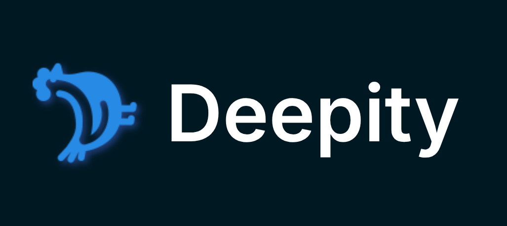
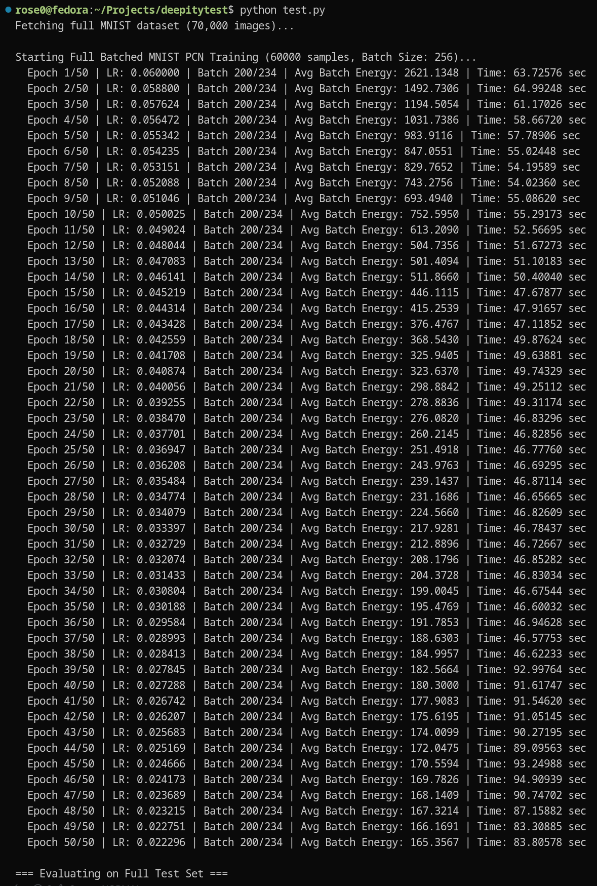
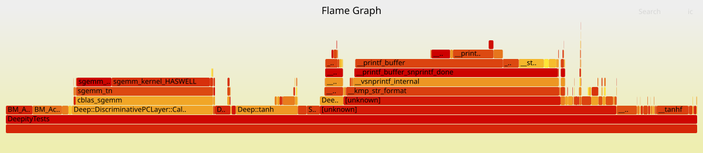
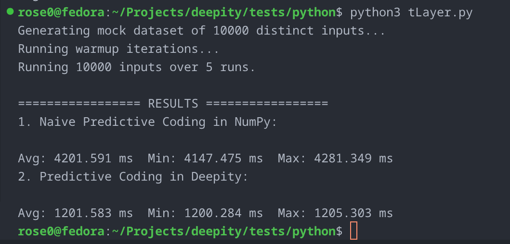
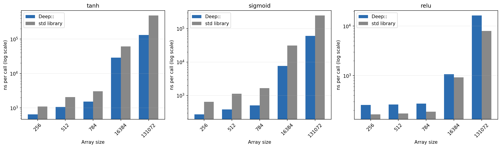
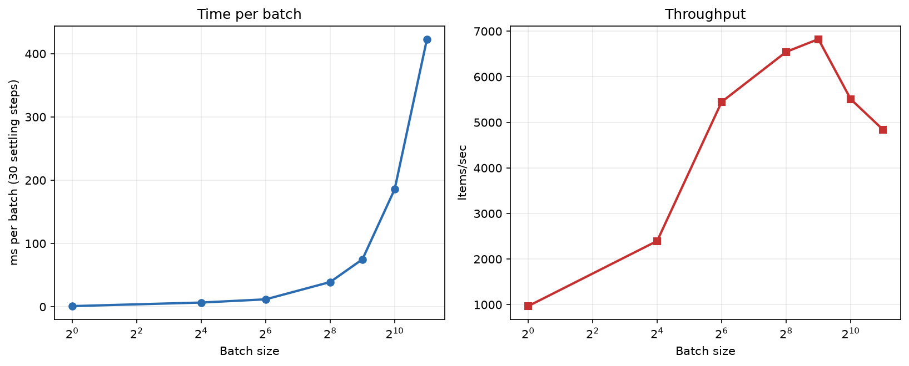

[](https://github.com/ra4ster/deepity/actions/workflows/ci.yml)
[](https://github.com/ra4ster/deepity/blob/main/LICENSE)
[](https://github.com/ra4ster/deepity/releases)
[](https://github.com/ra4ster/deepity/blob/main/pyproject.toml)
[](Chttps://github.com/ra4ster/deepity/blob/main/CMakeLists.txt)
[](https://github.com/ra4ster/deepity/stargazers)
[](https://github.com/ra4ster/deepity/issues)
[](https://github.com/ra4ster/deepity/commits/main)



Deepity is a Predictive Coding (PC) library engineered from the ground up for zero-overhead, ultra-low variance inference and learning. It is aggressively CPU-optimized to extract maximum throughput from modern hardware, with a CUDA backend currently in development.

### See it train MNIST on the CPU in under an hour:



---

## 🚀 Performance at a Glance



Deepity is built for speed. On a **Dell Inspiron 16 Plus 7620** (12th Gen Intel Core i7-12700H, 20 logical processors), the engine sustains approximately **123 GFLOPS** during predictive-coding inference and learning when compiled with Clang (LLVM).

**Benchmark Configuration:**

- **Architecture:** 784 → 512 → 256 → 64 → 10
- **Batch size:** 256
- **Iterations:** 157
- **Average runtime:** ~1.175 s (CPU time)

The dominant computation consists of batched single-precision matrix multiplications (`SGEMM`), corresponding to roughly 144.4 GFLOPs of floating-point work:

$$ \frac{144.4 \text{ GFLOPs}}{1.175 \text{ s}} \approx 122.89 \text{ GFLOPS} $$

By utilizing native C++ extensions via pybind11, Deepity maintains this performance footprint in Python with negligible overhead—running significantly faster than an equivalent, highly vectorized NumPy implementation.



| Implementation             |   Avg (ms) |   Min (ms) |   Max (ms) |
| :------------------------- | ---------: | ---------: | ---------: |
| **Deepity (Python/Clang)** | **1169.1** | **1167.8** | **1172.5** |
| NumPy (Naive)              |     4201.6 |     4147.5 |     4281.3 |

_Note: High-level research frameworks routinely incur heavy penalties from Python execution and tensor abstractions. Deepity bypasses this by keeping the entire inference loop in native C++ memory._

---

## ⚔️ GCC vs. Clang (LLVM) Performance

Recent benchmarking indicates that compiling Deepity with Clang (LLVM) provides measurable speedups across core neural network workloads compared to GCC. Because Clang handles our heavily vectorized SIMD micro-kernels more efficiently, it is the officially recommended compiler for maximum throughput.

- **Weight Updates:** Clang nearly halves the execution time for layer weight updates, dropping the CPU time for a size 128 layer from 1.24 ns (GCC) to 0.671 ns.
- **End-to-End Training:** A full training epoch (`BM_Network_TrainEpoch/128`) completes in 161,998 ns under Clang, a measurable improvement over GCC's 166,488 ns.
- **Inference Speed:** Network inference (`BM_Network_Inference/128`) executes in 44,791 ns with Clang, compared to 47,225 ns with GCC.

| Benchmark Workload (Size 128) | Deepity v2 (MemoryArena) | Deepity v1 (Legacy) |
| :---------------------------- | :----------------------- | :------------------ |
| `BM_Network_Inference`        | **11,245 ns**            | 44,791 ns           |
| `BM_Network_TrainSample`      | **12,988 ns**            | 38,094 ns           |
| `BM_Layer_UpdateWeights`      | **0.665 ns**             | 0.671 ns            |

_(Note: GCC retains a slight edge in linear derivative calculations and weight randomization, but Clang wins heavily in the primary training loop)._

Raw benchmark output for both compilers is checked into [`logs/results_GCC.txt`](logs/results_GCC.txt) and [`logs/results_LLVM.txt`](logs/results_LLVM.txt) (also available as [`logs/results.json`](logs/results.json)).

---

## ⚡ Core Architecture & Optimizations

Deepity achieves its low-variance execution times through strict memory management and custom hardware intrinsics.

**Custom SIMD Micro-Kernels**
We bypass standard C++ library bottlenecks by implementing highly optimized activation functions using raw AVX2 and AVX-512 intrinsics.

**Rational Polynomial Tanh**
Deepity avoids expensive `expf` instruction calls by utilizing a highly tuned Elliot Sigmoid approximation. This yields up to a 11000% speedup over a standard library version without sacrificing necessary precision.



**Saturated Vectorized ReLU**
The ReLU implementation processes up to 16 floats per clock cycle, completely saturating standard single-core RAM bandwidth limits (~15.8 GB/s).

**Strict 64-Byte Alignment**
To prevent hardware exceptions and segmentation faults when loading wide 256-bit or 512-bit registers, Deepity enforces strict 64-byte memory boundaries (`std::align_val_t{64}`) for all internal sequential sub-buffers.

**Contiguous Arena Allocator**
All layer buffers in a network are packed into a single contiguous memory block. This maximizes L1/L2 cache locality and eliminates pointer-chasing overhead across the layer hierarchy.

---

## 📊 Design Decisions & Benchmarks

During development, we benchmarked several architectural approaches to find the absolute ceiling for CPU throughput.

### The Impact of Batching

Batching provides massive scaling. A batch size of **256** proved to be the sweet spot for maximizing CPU utilization before cache eviction penalties take over.

| Batch Size | Time (ms) |
| ---------- | --------- |
| 1 (None)   | 4484      |
| 16         | 3149      |
| 64         | 2338      |
| **256**    | **2233**  |
| 512        | 2265      |



### Dynamic Thread Scheduling

During the implementation of OpenMP and OpenBLAS multithreading, benchmarking revealed a severe performance trap: **oversubscription and thread spin-up overhead**. For smaller batch sizes, the CPU spent more time waking up threads and managing locks than performing the actual matrix math, causing multi-threaded runs to perform worse than single-threaded execution.

By sweeping the batch sizes, we identified the exact mathematical break-even point where matrix payloads outgrow OS thread latency.

| Batch Size | Threads | Throughput (Items/sec) | Verdict                               |
| ---------- | ------- | ---------------------: | ------------------------------------- |
| 16-256     | 1       |                  ~2.6k | Single-thread dominates               |
| 16-256     | 4       |                  ~2.5k | Multithreading penalizes performance  |
| **1024**   | **Max** |             **~11.7k** | **The Ignition Point (4.5x Speedup)** |
| 16384      | Max     |                 ~14.3k | Peak multi-threaded scaling           |

### Memory Layout: Contiguous vs. Separate

Packing all layer attributes into a single flat array showed zero performance penalty over separate heap allocations, while providing vastly simpler alignment guarantees and predictable cache behavior.

| Layout           | Time (ms) |
| ---------------- | --------- |
| Separate vectors | 4481      |
| Contiguous block | 4484      |

### Random Number Generation

We tested `OpenRAND` against the standard `std::mt19937` generator. Because the results were within a 5% margin of error, we opted for the standard library MT implementation to minimize external dependencies.

---

## 🛠️ Example Usage

### C++

Running a Predictive Coding network in Deepity is built to be straightforward and explicit. The `DiscriminativePCNetwork` abstraction automatically manages layer hierarchies, bidirectionality, and dynamic thread scaling based on batch size.

```cpp
#include "DiscriminativePCNetwork.h"
#include "Activations.h"
#include <vector>
#include <random>
#include <iostream>

int main() {
    // Initialize a network with a batch size of 4 (e.g., for XOR)
    Deep::DiscriminativePCNetwork net(4);

    // Architecture: Input(2) -> Hidden(8) -> Terminal(1)
    // AddLayer(in, out, lr, ir, pr, lmbda, activation, derivative)
    net.AddLayer(2, 8, 0.05f, 0.3f, 0.00f, 0.0001f, Deep::tanh, Deep::dTanh);
    net.AddLayer(8, 1, 0.05f, 0.3f, 0.00f, 0.0001f, Deep::linear, Deep::dLinear);

    std::mt19937 rng(42);
    net.RandomizeWeights(rng);

    // Flattened, row-major input/target data
    std::vector<float> X = {-1,-1, -1,1, 1,-1, 1,1};
    std::vector<float> Y = {-1, 1, 1, -1};

    // Train using the clean TrainStep API (150 relaxation steps per epoch)
    for (int epoch = 0; epoch < 1500; ++epoch) {
        float energy = net.TrainStep(X, Y, 150);
    }

    // Run inference using the Predict API
    std::vector<float> predictions = net.Predict(X, 150);

    for (float pred : predictions) {
        std::cout << "Prediction: " << pred << "\n";
    }

    return 0;
}
```

### Python

The same engine is exposed to Python through native `pybind11` bindings (`bindings/pybinding.cpp`), compiled as the `pydeepity` extension module. This keeps the full training/inference loop in native C++ memory while still giving you a Python-friendly API and NumPy interoperability.

Working, runnable examples live in [`examples/`](examples/), including:

- [`examples/xor.py`](examples/xor.py) — minimal XOR training loop
- [`examples/mnist.py`](examples/mnist.py) / [`examples/train_mnist_deep.py`](examples/train_mnist_deep.py) — MNIST training end-to-end
- [`examples/train_tiny_digits.py`](examples/train_tiny_digits.py) — a smaller digits benchmark for quick iteration
- [`examples/test_ffnn.py`](examples/test_ffnn.py) / [`examples/test_pcn_torch.py`](examples/test_pcn_torch.py) — comparisons against feed-forward and PyTorch-based baselines
- [`examples/visualize.py`](examples/visualize.py) — plotting helpers for training curves and energy convergence

The compiled module is placed at `pydeepity/deepity.cpython-*.so` after building (see below), so `import pydeepity` works from the project root once the build completes.

---

## 🏗️ Building from Source

Deepity ships a single cross-platform build entrypoint, `build.py`, on top of CMake (with [`CMakePresets.json`](CMakePresets.json) defining the underlying configurations).

```bash
python build.py            # Release build (default) -> build/Release
python build.py Release    # explicit Release build   -> build/Release
python build.py Debug      # Debug build               -> build/Debug
```

Running `build.py` will:

1. Configure the project with CMake (Ninja if available, otherwise your default CMake generator), reusing the existing `CMakeCache.txt` when present.
2. Compile the library, Python bindings, and test suite in parallel across all logical cores.
3. Automatically locate and run the compiled `DeepityTests` executable.
4. Write a full, unabridged log of every phase to [`logs/build.log`](logs/build.log), so nothing is lost even when the terminal output is condensed.

If the optional [`rich`](https://github.com/Textualize/rich) package is installed, `build.py` renders a live status dashboard (configure/build/test phases, compile progress, streamed test output); if it isn't installed, the same build runs with plain stdout status lines instead — no functionality is lost either way.

Any configure, compile, or test failure prints the full diagnostic output and exits with the underlying tool's exit code.

### Requirements

- CMake
- A C++ compiler with AVX2/AVX-512 support — **Clang (LLVM) is recommended** for the SIMD-heavy activation kernels (see benchmarks above); GCC is also supported
- [Ninja](https://ninja-build.org/) (optional, auto-detected — falls back to your default CMake generator otherwise)
- Python 3 (for the `pydeepity` bindings and `build.py` itself) — see [`pyproject.toml`](pyproject.toml) / [`setup.py`](setup.py) for the Python packaging metadata

---

## 📚 Documentation

API reference documentation is generated from source comments via Doxygen (see [`Doxyfile`](Doxyfile)) and published under [`docs/html`](docs/html) (with LaTeX output also available under [`docs/latex`](docs/latex)). Regenerate it locally with:

```bash
doxygen Doxyfile
```

---

## ✅ Testing

The `DeepityTests` executable, built automatically by `build.py`, currently
compiles a single source file: [`tests/tResearch.cpp`](tests/tResearch.cpp).
That's the suite CI actually runs.

The rest of [`tests/`](tests/) contains additional test/benchmark source
files that are **not currently wired into the `DeepityTests` target** in
`CMakeLists.txt` (`add_executable(DeepityTests tests/tResearch.cpp)` lists
only the one file) — they exist in the tree but aren't compiled or run as
part of a normal build:

- `tNetwork.cpp`, `tSimple.cpp`, `tDiagnose.cpp` — core network correctness
- `tConvGradCheck.cpp` — gradient checking for convolutional layers
- `tActivations.cpp`, `tClamp.cpp` — activation/utility kernel correctness
- `tBenchmark.cpp`, `tProfile.cpp` — throughput and profiling benchmarks
- `tAsan.cpp` — AddressSanitizer coverage
- `tReadme.cpp` — README-example verification

If you want to build and run one of these, add it to the `DeepityTests`
sources in `CMakeLists.txt` (or create a separate `add_executable` target for
it) — see [CONTRIBUTING.md](CONTRIBUTING.md) for the CMake target-ordering
gotchas that apply when doing so.

Research and long-running experiments (checkpoints, MNIST training runs, step-tuning sweeps, LinkedIn write-ups, etc.) live separately under [`experiments/`](experiments/) and are not part of the core build.

---

## 📅 Roadmap

Deepity's roadmap will move to (WIP) [`Roadmap.md`](Roadmap.md) for tracking in more detail. At a glance, completed and in-progress work includes:

- [x] SIMD micro-kernels (AVX2/AVX-512 Padé approximations)
- [x] Contiguous flat-memory buffers
- [x] PCNetwork abstraction (Layer hierarchy & bidirectional inference)
- [x] Python bindings (pybind11 + NumPy support)
- [x] API reference documentation (Doxygen)
- [x] Multithreading and Precision Metrics
- [x] Memory Arena Contiguity
- [ ] File IO Support (🚧)
- [ ] CUDA accelerated engine (GPU GEMM operations for massive scales)
- [ ] Java port

---

## 🤝 Contributing

Contributions are welcome — please read [`CONTRIBUTING.md`](CONTRIBUTING.md) and our [`CODE_OF_CONDUCT.md`](CODE_OF_CONDUCT.md) before opening a pull request.

## 📄 License

Deepity is distributed under the terms in [`LICENSE`](LICENSE).

## 🏗️ Project Structure

```plaintext
include/deepity/       # Public headers (PCLayer/Network hierarchy, Activations, MemoryArena, ...)
include/deepity/layers/    # Layer implementations (Simple, Conv, RB, Discriminative PC layers)
include/deepity/networks/  # Network abstractions (Simple, Conv, Discriminative PC networks)
src/                    # C++ source implementations
bindings/               # Python bindings (pybind11)
pydeepity/              # Compiled Python extension module (generated)
examples/               # Runnable Python examples (XOR, MNIST, benchmarking, visualization)
experiments/            # Research scripts, training checkpoints, and benchmark output (not part of the core build)
tests/                  # C++ test and benchmark suites
docs/                   # Generated Doxygen documentation (html/ and latex/)
resources/              # Images and benchmark assets
logs/                   # Build logs and raw benchmark output (GCC vs. LLVM, JSON results)
build/                  # Build outputs (library, executables, Python .so) — created by build.py
build.py                # Cross-platform CMake build & test runner
CMakeLists.txt / CMakePresets.json   # Build configuration
Doxyfile                # Doxygen configuration
pyproject.toml / setup.py            # Python packaging metadata
Roadmap.md              # Detailed project roadmap
CONTRIBUTING.md / CODE_OF_CONDUCT.md # Contribution guidelines
```

<small><i>
Ra4ster (Jack R) @ 2026 ❤️
</i></small>
