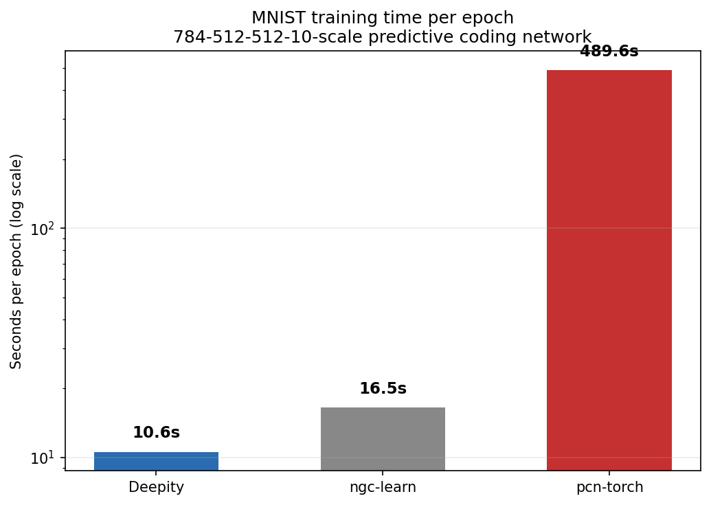

[](https://github.com/ra4ster/deepity/actions/workflows/ci.yml)
[](https://github.com/ra4ster/deepity/blob/main/LICENSE)
[](https://github.com/ra4ster/deepity/releases)
[](https://github.com/ra4ster/deepity/blob/main/pyproject.toml)
[](https://github.com/ra4ster/deepity/blob/main/CMakeLists.txt)
[](https://github.com/ra4ster/deepity/stargazers)


## What is this?

Most neural networks learn using backpropagation: a single error signal computed at the output gets sent backward through every layer in sequence. Predictive coding is a different way to train a network. Instead of one long backward pass, each layer keeps its own internal guess about what it expects to see, compares that guess to what actually arrived from the layer below, and adjusts locally to reduce the difference. No signal has to travel end to end, and no layer needs to know anything about layers it isn't directly connected to.

Deepity is a predictive coding library for Python and C++, built to make this style of network fast and practical to actually run. It's written from scratch in C++, tuned for CPU (hand-written SIMD kernels, a contiguous memory layout, an optional Intel MKL backend), with GPU support in development.

## Installation

```bash
git clone https://github.com/ra4ster/deepity
cd deepity
python build.py
```

```bash
python build.py [Release/Debug] [OpenBLAS/MKL] [--native/--fast/--distributed] [--clean] [--jobs=N] [--no-cuda] [--pgo] [--verbose]
```

`--pgo` runs a full profile-guided optimization pass: builds an instrumented binary, runs a short representative workload to collect real branch and call-frequency data, then rebuilds using it. Roughly doubles build time; the workload itself takes well under a minute.

`pip install rich` first for a live build dashboard.

<div align="center">

</div>

## Quick start

```python
import numpy as np
from pydeepity import SimplePCN

net = SimplePCN(batch_size=250)
net.add_layer(784, 512, lr=0.001, ir=0.08, act="linear")
net.add_layer(512, 512, lr=0.001, ir=0.08, act="sigmoid")
net.add_layer(512, 10, lr=0.001, ir=0.08, act="sigmoid")
net.add_layer(10, 0, lr=0.001, ir=0.08, act="linear")
net.set_optimizer("ADAM")
net.compile()
net.randomize_weights()

energy = net.train_step_with_projection(X_batch, Y_batch, steps=20)
predictions = net.predict_with_projection(X_batch, steps=20)
```

Working examples live in [`examples/`](examples/), including full MNIST training, XOR, and comparisons against feed-forward and PyTorch baselines.

<div align="center">

</div>

---

## Performance

Deepity is built CPU-first, and most of its design choices exist to make that fast rather than just correct.

### Training speed

Training a 784-512-512-10 network on MNIST, measured directly against two other predictive-coding libraries on the same task:

<div align="center">

</div>

Deepity also reached higher test accuracy than the JAX-based reference implementation on this task (97.04% vs 95.09%), though the two use meaningfully different architectural configurations, and this isn't the main point: the speed difference holds regardless of which one happens to score higher on a given run.

### Activation functions

Custom SIMD kernels (AVX2/AVX-512, backed by SLEEF) versus naive standard-library loops, across a range of array sizes:

<div align="center">

</div>

The custom kernels are meaningfully faster for `tanh` and `sigmoid`, both of which lean on expensive transcendental math where a hand-tuned vectorized implementation has real room to win. `relu` is the exception: it's simple enough that the compiler's own auto-vectorizer handles a plain loop just as well, and our hand-written version actually runs slower there. We're keeping this result visible rather than only showing the wins.

### Batching

<div align="center">

</div>

Throughput rises with batch size up to a point (peaking around batch size 512 on the hardware this was measured on) before cache-eviction costs start eating into the gains from larger batches.

### GEMM throughput

<div align="center">

</div>

On a Dell Inspiron 16 Plus 7620 (12th Gen Intel Core i7-12700H, 20 logical processors), Deepity sustains approximately 123 GFLOPS during predictive-coding inference and learning when compiled with Clang. Benchmark configuration: architecture 784-512-256-64-10, batch size 256, 157 iterations, ~1.175s average CPU time, dominated by batched single-precision GEMM (~144.4 GFLOPs of floating-point work).

<div align="center">

</div>

| Implementation         | Avg (ms) | Min (ms) | Max (ms) |
| :--------------------- | -------: | -------: | -------: |
| Deepity (Python/Clang) |   1169.1 |   1167.8 |   1172.5 |
| NumPy (naive)          |   4201.6 |   4147.5 |   4281.3 |

### Threading

Naive multithreading across small batch sizes made performance worse, not better, since the CPU spent more time waking threads than doing matrix math:

| Batch Size | Threads | Throughput (items/sec) | Result                               |
| ---------- | ------- | ---------------------: | ------------------------------------ |
| 16-256     | 1       |                  ~2.6k | Single-thread dominates              |
| 16-256     | 4       |                  ~2.5k | Multithreading penalizes performance |
| 1024       | Max     |                 ~11.7k | 4.5x speedup                         |
| 16384      | Max     |                 ~14.3k | Peak multi-threaded scaling          |

---

## How it's built

**Custom SIMD micro-kernels.** Activation functions are implemented with raw AVX2/AVX-512 intrinsics and SLEEF, not generic standard-library calls.

**Mu-caching.** While a layer is clamped, its outgoing prediction is provably constant for the whole settling loop, since nothing feeding into it changes mid-settle. Skipping that recomputation is an exact optimization, not an approximation.

**Contiguous memory arena.** Every layer's buffers live in one flat, cache-aligned allocation instead of scattered individual heap allocations, with an optional huge-pages backend for workloads that benefit from it.

**Multiple network variants, choose what fits.** Deepity isn't a single fixed algorithm:

| Variant                     | What it is                                                                                                                                                      |
| --------------------------- | --------------------------------------------------------------------------------------------------------------------------------------------------------------- |
| `SimplePCN`                 | Synchronous (Jacobi) settling, every layer updates together each step. The default starting point.                                                              |
| `GaussSeidelPCN`            | Sequential-sweep settling, layers see each other's already-updated values within the same step. Generally higher accuracy per epoch, at a real throughput cost. |
| `DiscriminativePCN`         | The original, precision-weighted variant, closest to the classical Whittington & Bogacz formulation.                                                            |
| `ConvPCN` / `SimpleConvPCN` | Convolutional predictive coding layers, for image-shaped input rather than flat vectors.                                                                        |

**Optional Intel MKL backend.** Build with `-DDEEPITY_USE_MKL=ON` for a further speedup on Intel hardware (falls back to OpenBLAS automatically if MKL isn't found).

For the algorithmic details behind these (including a couple of surprising findings from comparing against other implementations), see [`docs/ALGORITHM.md`](docs/ALGORITHM.md).

## C++ Native

```cpp
#include <deepity/networks/SimplePCNetwork.h>

Deep::SimplePCNetwork net(4);
net.AddLayer(2, 4, 0.01f, 0.1f, 0.0f, Deep::ActivationType::TANH, Deep::ActivationType::dTANH);
net.AddLayer(4, 1, 0.01f, 0.1f, 0.0f, Deep::ActivationType::TANH, Deep::ActivationType::dTANH);
net.AddLayer(1, 0, 0.01f, 0.1f, 0.0f, Deep::ActivationType::LINEAR, Deep::ActivationType::dLINEAR);
net.Compile();

std::vector<float> X = {-1, -1, -1, 1, 1, -1, 1, 1};
std::vector<float> Y = {-1, 1, 1, -1};

for (int epoch = 0; epoch < 1500; ++epoch) {
    float energy = net.TrainStep(X, Y, 150);
}

std::vector<float> predictions = net.Predict(X, 150);
```

## Requirements

- CMake
- A C++20 compiler with AVX2/AVX-512 support (Clang recommended for the SIMD-heavy activation kernels; GCC also supported) and OpenMP
- [Ninja](https://ninja-build.org/), optional and auto-detected
- Python 3.9+, for the pydeepity bindings and build.py itself

## Documentation

API reference documentation is generated from source comments via Doxygen (see [`Doxyfile`](Doxyfile)) and published under [`docs/html`](docs/html). Regenerate locally with:

```bash
doxygen Doxyfile
```

## Roadmap

- [x] SIMD micro-kernels (AVX2/AVX-512)
- [x] Contiguous flat-memory buffers
- [x] PCNetwork abstraction, layer hierarchy, bidirectional inference
- [x] Python bindings (pybind11 and NumPy support)
- [x] Mu-caching
- [x] Optional Intel MKL backend
- [x] Optional huge-pages memory backend
- [x] GaussSeidelPCN sequential-sweep settling
- [ ] [Direct Kolen-Pollack Predictive Coding](https://arxiv.org/pdf/2602.15571) (🚧)
- [ ] File IO support (save/load trained models)
- [ ] CuBLAS

## Contributing

Contributions are welcome. Please read [`CONTRIBUTING.md`](CONTRIBUTING.md) and [`CODE_OF_CONDUCT.md`](CODE_OF_CONDUCT.md) before opening a pull request.

## Project structure

```plaintext
include/deepity/           Public headers: Layer hierarchy, Activations, MemoryArena
include/deepity/layers/    SimplePCLayer, GaussSeidelPCLayer, ConvPCLayer, and others
include/deepity/networks/  SimplePCNetwork, GaussSeidelPCNetwork, and others
src/                        C++ source implementations
bindings/                   Python bindings (pybind11)
pydeepity/                  Compiled Python extension module (generated)
examples/                   Runnable Python examples
tests/                      C++ gradient-check and verification suites
resources/                  Images and benchmark assets
CMakeLists.txt               Build configuration (OpenBLAS/MKL, CUDA, arch profiles)
build.py                    Cross-platform CMake build and test runner
mnist.py                    Train a Simple PCN to learn MNIST
```

## License

Deepity is distributed under the terms in [`LICENSE`](LICENSE).

<small><i>Ra4ster (Jack R) @ 2026 ❤️</i></small>
