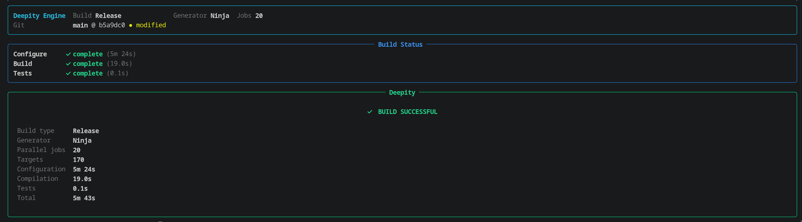
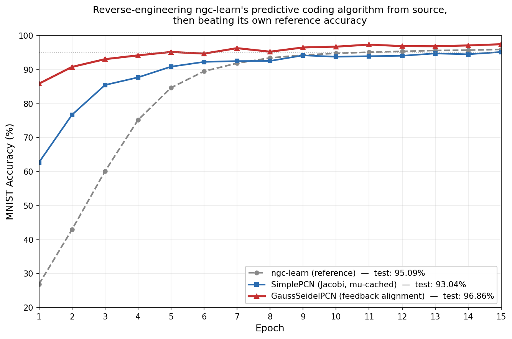

[](https://github.com/ra4ster/deepity/actions/workflows/ci.yml)
[](https://github.com/ra4ster/deepity/blob/main/LICENSE)
[](https://github.com/ra4ster/deepity/releases)
[](https://github.com/ra4ster/deepity/blob/main/pyproject.toml)
[](https://github.com/ra4ster/deepity/blob/main/CMakeLists.txt)
[](https://github.com/ra4ster/deepity/stargazers)


Deepity is a Predictive Coding (PC) library built from scratch in C++ for low-overhead, CPU-optimized inference and learning, with an optional CUDA backend in development. It implements the same class of algorithm as [ngc-learn](https://github.com/NACLab/ngc-learn), the JAX-based reference library for predictive coding networks, but as an independent C++ engine rather than a wrapper or port.

Building from source:

```bash
# 1. Clone the repository
git clone https://github.com/ra4ster/deepity

# 2. Build with Python
python build.py

# python build.py [Release/Debug] [OpenBLAS/MKL] [--native/--fast/--distributed] [--clean] [--jobs=N] [--no-cuda] [--verbose]
```

We recommend `pip install rich` for a live build dashboard.

<div align="center">

</div>

### Training MNIST on CPU

<div align="center">

</div>

---

## Matching and exceeding a reference implementation

We spent a significant part of this project's development reconstructing ngc-learn's predictive coding algorithm directly from its documentation and source, rather than assuming the textbook description was the whole story. Two specific findings from that process:

**The activation function is applied before the linear transform, not after.** The commonly cited form is `mu = phi(Wz + b)`. The formula ngc-learn actually runs is `mu = W * phi(z) + b`, confirmed against both its documented differential equations and its real synapse wiring code.

**The feedback pathway uses a separate, independently initialized matrix, not the transpose of the forward weights.** The clean textbook notation for the backward error signal is `(W)^T * e`. The actual implementation wires a distinct StaticSynapse, randomly initialized and never updated during training: feedback alignment (Lillicrap et al., 2016) rather than symmetric backprop-style weights.

Once both of these were implemented and matched against ngc-learn's own documented hyperparameters (weight init range, optimizer, learning rate schedule), our SimplePCN variant trained on MNIST outperformed ngc-learn's published reference run, on CPU, with no JIT compilation:

<div align="center">

</div>

Both curves use the same 784-512-512-10 architecture and the same 20-step settling budget per batch. Deepity's run reached 96.72% test accuracy versus ngc-learn's 95.09%, and converged faster in the earlier epochs.

Extending training to 50 epochs pushes test accuracy to 97.99%, though the gains past epoch 30 are modest, likely some combination of the learning rate schedule decaying toward its floor and the accuracy curve itself having less room left to climb. We haven't isolated which effect dominates.

Deepity also includes GaussSeidelPCN, a second settling scheme (sequential-sweep rather than fully synchronous updates) that separately reached 96.86% test accuracy in earlier testing, though under a different activation configuration than the run above and not yet re-verified under the corrected setup. We are treating that as an open item rather than a confirmed second result.

---

## Core architecture and optimizations

**Custom SIMD micro-kernels.** Activation functions are implemented with raw AVX2 and AVX-512 intrinsics rather than relying on standard library calls.

<div align="center">

</div>

**Mu-caching.** A clamped layer's outgoing prediction is provably constant for the duration of a settling loop, since neither its state nor the weights change mid-settle. Skipping its recomputation is an exact optimization rather than an approximation, and it targets a class of redundant work that a statically JIT-compiled computation graph cannot skip as cheaply at runtime.

**Contiguous arena allocator.** All layer buffers within a network are packed into a single contiguous memory block, improving L1/L2 cache locality and removing pointer-chasing across the layer hierarchy.

**Optional Intel MKL backend.** Build with `-DDEEPITY_USE_MKL=ON` (falls back to OpenBLAS automatically if MKL isn't found on the system) for a further speedup on Intel hardware.

---

## Benchmarks

<div align="center">

</div>

On a Dell Inspiron 16 Plus 7620 (12th Gen Intel Core i7-12700H, 20 logical processors), Deepity sustains approximately 123 GFLOPS during predictive-coding inference and learning when compiled with Clang.

Benchmark configuration: architecture 784-512-256-64-10, batch size 256, 157 iterations, average runtime approximately 1.175s CPU time. The dominant computation is batched single-precision GEMM, corresponding to roughly 144.4 GFLOPs of floating-point work.

<div align="center">

</div>

| Implementation | Avg (ms) | Min (ms) | Max (ms) |
| :-------------- | -------: | -------: | -------: |
| Deepity (Python/Clang) | 1169.1 | 1167.8 | 1172.5 |
| NumPy (naive) | 4201.6 | 4147.5 | 4281.3 |

### Batching

<div align="center">

</div>

| Batch Size | Time (ms) |
| ---------- | --------- |
| 1 (none) | 4484 |
| 16 | 3149 |
| 64 | 2338 |
| 256 | 2233 |
| 512 | 2265 |

A batch size of 256 was the sweet spot before cache eviction penalties began to outweigh the throughput gains of larger batches.

### Threading

Naive multithreading across small batch sizes made performance worse, not better, since the CPU spent more time waking threads than doing matrix math. The break-even point where matrix payloads outgrow thread spin-up latency:

| Batch Size | Threads | Throughput (items/sec) | Result |
| ---------- | ------- | ----------------------: | ------ |
| 16-256 | 1 | ~2.6k | Single-thread dominates |
| 16-256 | 4 | ~2.5k | Multithreading penalizes performance |
| 1024 | Max | ~11.7k | 4.5x speedup |
| 16384 | Max | ~14.3k | Peak multi-threaded scaling |

---

## Python

```python
import numpy as np
from pydeepity import SimplePCN

net = SimplePCN(batch_size=250)
net.add_layer(784, 512, lr=0.001, ir=0.08, act="linear")
net.add_layer(512, 512, lr=0.001, ir=0.08, act="sigmoid")
net.add_layer(512, 10, lr=0.001, ir=0.08, act="sigmoid")
net.add_layer(10, 0, lr=0.001, ir=0.08, act="linear")
net.set_optimizer("ADAM")
net.compile()
net.randomize_weights()

energy = net.train_step_with_projection(X_batch, Y_batch, steps=20)
predictions = net.predict_with_projection(X_batch, steps=20)
```

Working examples live in [`examples/`](examples/), including full MNIST training, XOR, and comparisons against feed-forward and PyTorch baselines.

## C++

```cpp
#include <deepity/networks/SimplePCNetwork.h>

Deep::SimplePCNetwork net(4);
net.AddLayer(2, 4, 0.01f, 0.1f, 0.0f, Deep::ActivationType::TANH, Deep::ActivationType::dTANH);
net.AddLayer(4, 1, 0.01f, 0.1f, 0.0f, Deep::ActivationType::TANH, Deep::ActivationType::dTANH);
net.AddLayer(1, 0, 0.01f, 0.1f, 0.0f, Deep::ActivationType::LINEAR, Deep::ActivationType::dLINEAR);
net.Compile();

std::vector<float> X = {-1, -1, -1, 1, 1, -1, 1, 1};
std::vector<float> Y = {-1, 1, 1, -1};

for (int epoch = 0; epoch < 1500; ++epoch) {
    float energy = net.TrainStep(X, Y, 150);
}

std::vector<float> predictions = net.Predict(X, 150);
```

---

## Requirements

- CMake
- A C++20 compiler with AVX2/AVX-512 support (Clang recommended for the SIMD-heavy activation kernels; GCC also supported)
- [Ninja](https://ninja-build.org/), optional and auto-detected
- Python 3.9+, for the pydeepity bindings and build.py itself

## Documentation

API reference documentation is generated from source comments via Doxygen (see [`Doxyfile`](Doxyfile)) and published under [`docs/html`](docs/html). Regenerate locally with:

```bash
doxygen Doxyfile
```

## Roadmap

- [x] SIMD micro-kernels (AVX2/AVX-512)
- [x] Contiguous flat-memory buffers
- [x] PCNetwork abstraction, layer hierarchy, bidirectional inference
- [x] Python bindings (pybind11 and NumPy support)
- [x] Mu-caching
- [x] Optional Intel MKL backend
- [x] GaussSeidelPCN sequential-sweep settling
- [ ] Re-verify GaussSeidelPCN under the corrected activation configuration
- [ ] CUDA-accelerated engine
- [ ] File IO support

## Contributing

Contributions are welcome. Please read [`CONTRIBUTING.md`](CONTRIBUTING.md) and [`CODE_OF_CONDUCT.md`](CODE_OF_CONDUCT.md) before opening a pull request. We are particularly interested in hearing from anyone working in predictive coding, computational neuroscience, or CPU numerical performance.

## Project structure

```plaintext
include/deepity/           Public headers: Layer hierarchy, Activations, MemoryArena
include/deepity/layers/    SimplePCLayer, GaussSeidelPCLayer, ConvPCLayer, and others
include/deepity/networks/  SimplePCNetwork, GaussSeidelPCNetwork, and others
src/                        C++ source implementations
bindings/                   Python bindings (pybind11)
pydeepity/                  Compiled Python extension module (generated)
examples/                   Runnable Python examples
tests/                      C++ gradient-check and verification suites
resources/                  Images and benchmark assets
CMakeLists.txt               Build configuration (OpenBLAS/MKL, CUDA, arch profiles)
build.py                    Cross-platform CMake build and test runner
```

## License

Deepity is distributed under the terms in [`LICENSE`](LICENSE).

<small><i>Ra4ster (Jack R) @ 2026</i></small>
